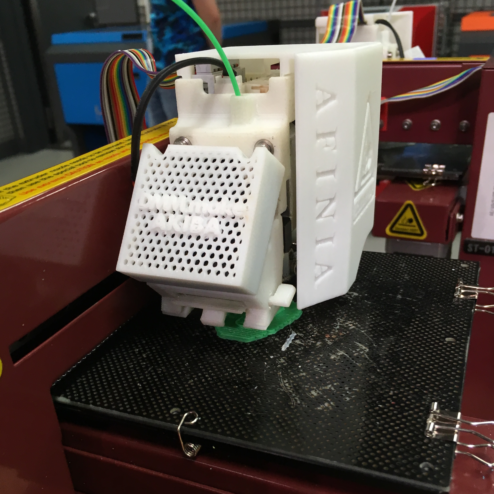
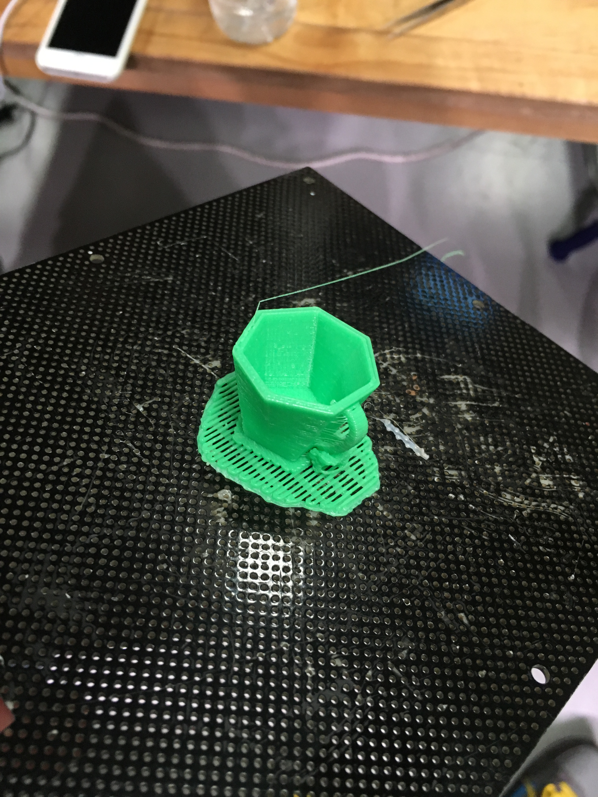
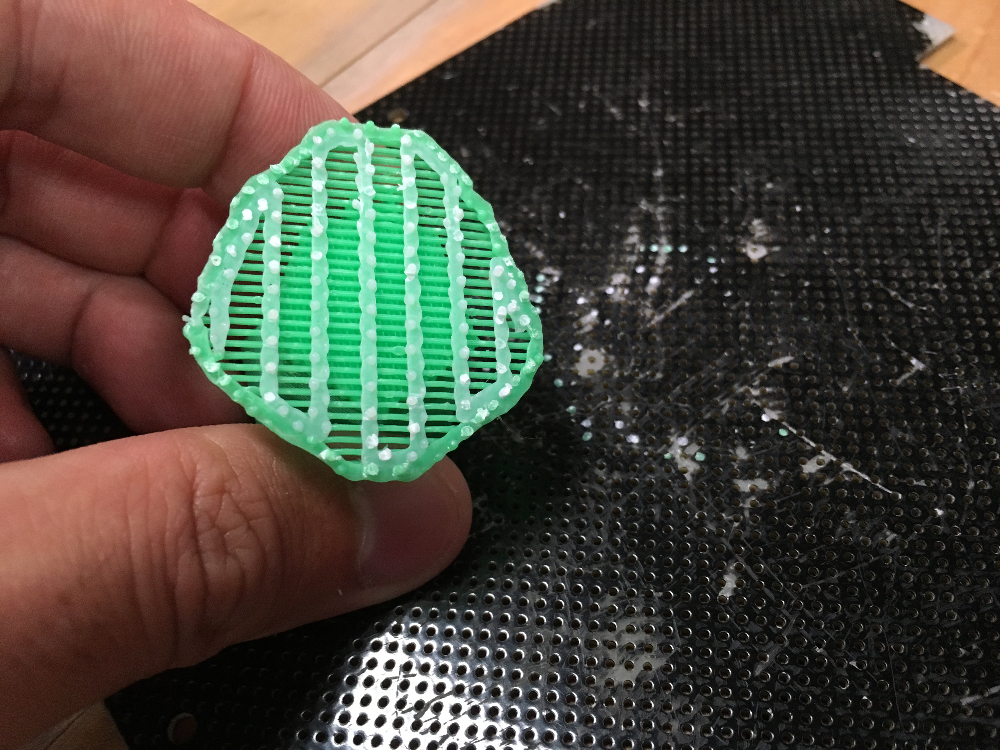
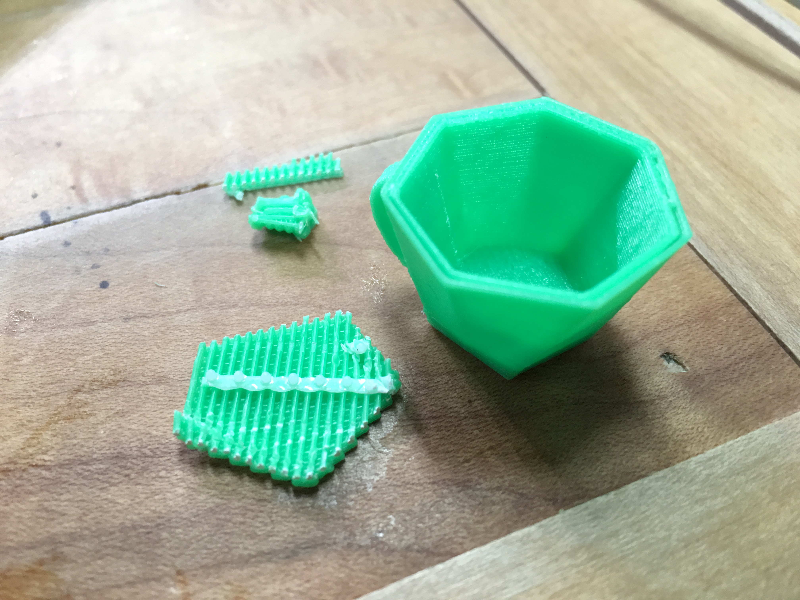

3Dプリンター

2016/06/12

[はじめての3Dプリント体験](http://dmmmake1606print.peatix.com/view)に行ってきた話。

# 使うソフト

- Autodesk 123D Design

# 3Dプリンタの歴史

RepRap

- 3Dプリンタが自身を複製するプロジェクト

光造形　1980年　日本で発明された

家庭用FDM

- ABS 270℃
- ノズル 0.3mm

# 123D Design

## 形状の作り方

- 押し出し(extrude)
- 回転(revolve)

combineで複数のオブジェクトを足し引きする。

## コップを作る

- polylineを選択
    - L字の形状を作る
- construct
    - 回転（revolve）

constructすると元のスケッチとは関係のないオブジェクトが生成される。

- cylinderを作る
- 大きなシリンダー、小さなシリンダーの2つ
- cylinderの中心を合わせる
- conbineからsubtractを選択し、大きなシリンダーから小さなシリンダーを引く
    - target object, source objectの順に選択する

プリミティブの上にスケッチを作ることが出来る。

# 3Dプリント

## 機材

- [AFINIA H480 3Dプリンタ](http://afinia.com/3d-printers/h480/)
- 材料
    - プラ
    - ABS

## 手順

DMM.make AKIBAのテックスタッフさんにメールして処理したので、
プリンタの細かい設定とかは良くわからず。

## 造形

造形ピッチは0.3mmで設定。
ラフト（raft=いかだ）という足場を作ってその上に造形していく。

細かな穴が開いている部分はセルボードという。
スクレイパーを使ってガリガリ剥がす。

ラフトやサポートはニッパーでもぎ取る。切るというよりつまんで捻って剥がす。
造形物を壊さないように注意。余計な部分を除去するとこんな感じ。

よく見ると壁が2重になっている。
密の部分はプリンタドライバがよしなに埋めてくれる（密度は設定出来る）が、
上手く埋まらないとこうなってしまうとか。

----

# 総評

すごくスムーズにいって楽しいワークショップだった。
123D Designを学ぶことができたし、3Dプリンタのなんたるかも理解できた。
次にやるときは1時間くらいで同じものが作れると思う。

細かな部品を作ってみたい。