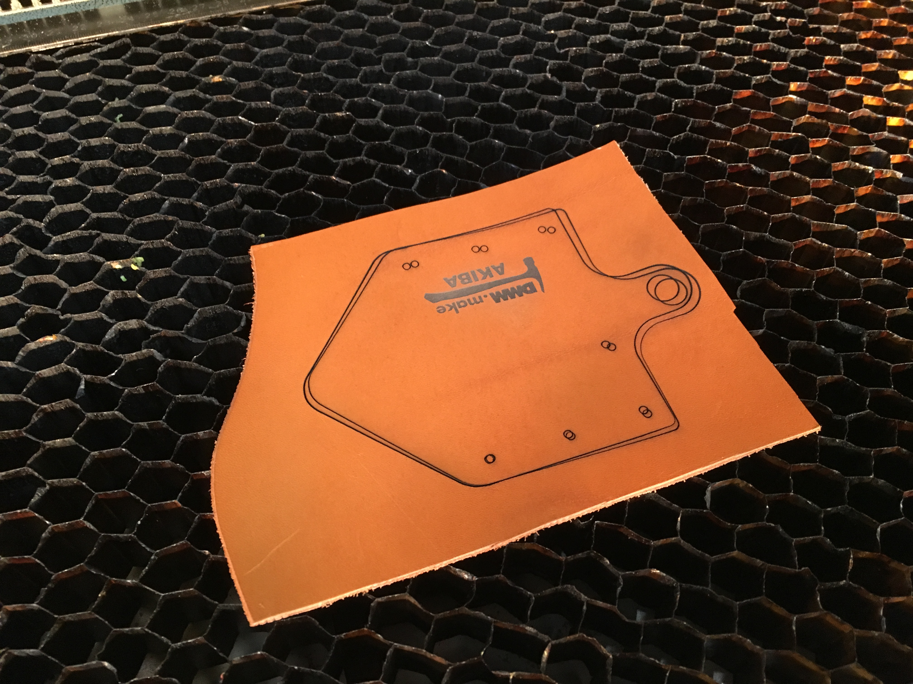

# レーザーカッター

2016/06/05

DMM.make AKIBAのワークショップで見せてもらった。

## 手順

1. 加工データを読み込む
2. 材料をレーザーカッターに載せる
3. レーザーをキャリブレーションする
    - 加工ベッドを上下させて焦点を合わせる
    - レーザー発振機に治具を取り付けてベッドを上げていき、治具が倒れたら焦点が合ったことになる
4. 出力と時間の設定
5. 加工開始

## 加工データ形式

- Adobe Illustratorで読み込めるもの
    - ai
    - dxf

## 出力の設定

各パス（色で分かれている）に対して、レーザー出力、移動時間を設定する。
出力が高いほど、移動時間が短いほど、切断の能力が高い（熱が集中する）。
ワークショップでは牛革を加工したが、出力50、移動時間0.6とした。

材料、厚み、気温や湿度に影響を受ける。試し切りが必要。

加工範囲はGUI上で確認するか、レーザー出力をゼロにして動きで確認する。

## 加工ベッドへの材料設置

なるべく平らになるように置く。
どうしても曲がってしまう材料は、金尺など質量があり高さの低い物体で押さえる。

----

# 感想

分かってしまえばかなり簡単。普通のプリンタ＋αくらいの印象。
