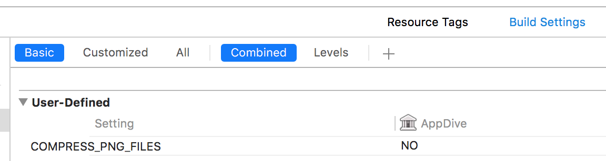

# PNGファイル圧縮

2016/12/05

少し前にいつしか追加された *PNGファイル圧縮のビルド設定* により
テストがコケまくってハマったのでメモっておく。

Xcodeには **Compress PNG files** というビルドオプションがあり、これを **Yes** にするとビルド後の集められたPNGファイルが圧縮される。

なんかファイル違くない？と思った人はご確認ください。